# rustcoin3d — Industrial 3D Visualization Engine

**English** · [简体中文](README.zh-cn.md) · [日本語](README.ja.md)

Coin3D/HOOPS-aligned 3D visualization engine in Rust + wgpu. Built for
large-scale industrial visualization: CAD import, real-time PBR rendering,
node-graph compositing, and interactive scene editing — all in a desktop
Studio application.

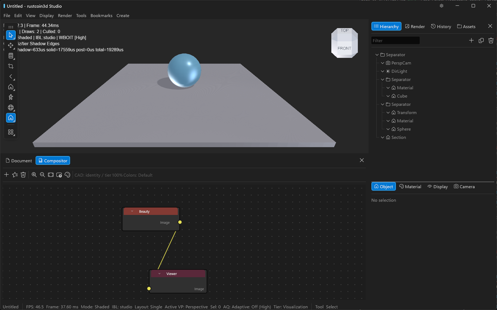

## Highlights

- **Rust + wgpu 30** renderer: cluster-deferred PBR, CSM shadows, HZB occlusion, TAA/SSR/SSAO
- **Scene graph** with 62 node types (Coin3D/Inventor-style `Separator`/`Switch`/`LOD`, cameras, lights, annotations, manipulators)
- **Blender-style compositor** node graph (`egui-snarl`) for real-time image compositing
- **Industrial CAD** in mind: NURBS, section/hatch, GD&T/PMI, hidden-line, point cloud (OOC)
- **Desktop Studio** with Model / LookDev / Compositor workspaces and full i18n (EN/简体中文)
- 51 examples covering rendering, lighting, import, animation, editors, and diagnostics

## Documentation

| Document | Description |
|----------|-------------|
| [Architecture](docs/architecture.md) | Crate dependency graph, core design principles, key data structures, NodeData reference |
| [Rendering Pipeline](docs/rendering-pipeline.md) | Full frame pipeline, culling, lighting, PBR shading, post-processing, draw call batching |
| [Scene Graph](docs/scene-graph.md) | SceneGraph API, all node types, traversal model, dirty flags, animation, serialization |
| [Engine System](docs/engine-system.md) | Simulation engines, time management, physics, sensors, field connections |
| [Shaders](docs/shaders.md) | Complete catalog of WGSL shaders with data structures and performance notes |
| [Gap Analysis](docs/industrial-viz-gap-analysis.md) | Coin3D/HOOPS comparison, roadmap, TODO checklist |
| [Optimization Guide](docs/optimization-guide.md) | GPU culling, mesh pool, static frame fast path, LightSetTable, shared utils |
| [Changelog](CHANGELOG.md) | Release notes and notable changes |

## Quick Start

```bash
# Desktop editor
cargo run -p rc3d-studio

# Build all examples
cargo build -p rc3d-examples --examples

# Import and view a 3D file
cargo run -p rc3d-examples --example import_viewer -- model.stl

# Stress test with adaptive quality
cargo run -p rc3d-examples --example adaptive_stress_test

# CLI editor (terminal)
cargo run -p rc3d-cli-editor
```

## Architecture

```
crates/
├── rc3d-core/       — Math, AABB, BVH, ID types, shared utils (graph, hash, ring, sort)
├── rc3d-fields/     — Field/connection system (Coin3D-style)
├── rc3d-scene/      — Scene graph (SlotMap<NodeId, NodeEntry>), node types, animation
├── rc3d-nodes/      — Re-exports (convenience crate)
├── rc3d-mesh/       — Triangle mesh, meshlet generation, LOD, tessellation
├── rc3d-nurbs/      — NURBS curves and surfaces
├── rc3d-actions/    — Traversal actions (ray pick, bounding box, undo, events, intersection)
├── rc3d-engine/     — Simulation engines, time management, physics, scheduler
├── rc3d-io/         — File import (STL, OBJ, glTF, FBX, Inventor) and export
├── rc3d-render/     — wgpu renderer (PBR, shadows, culling, post-fx, shaders)
├── rc3d-gizmo/      — 3D manipulator (translate, rotate, scale)
├── rc3d-script/     — Rhai scripting engine
├── rc3d-pointcloud/ — Large-scale point cloud octree (OOC)
├── rc3d-pdf/        — 3D PDF export (U3D)
├── rc3d-engine-api/ — Engine facade (window, camera, render, compositor)
├── rc3d-editor/     — Editor library (keymap, commands, apply, Fluent UI)
├── rc3d-examples/   — Demo applications (51 examples)
├── rc3d-studio/     — Desktop editor host (workspaces, i18n, case library)
└── rc3d-cli-editor/ — Terminal-based editor
```

## Rendering

Cluster-deferred PBR renderer with a full HDR post chain.

| Feature | Description |
|---------|-------------|
| **PBR** | Metallic-roughness (GGX/Smith) with IBL (HDR environment maps, BRDF LUT) |
| **Shadows** | CSM (4 cascades, 8% blend zones), omni-directional point light shadows |
| **Lighting** | Cluster-based forward (16×8×24 grid), LightSetTable dedup (1280B→4B/draw) |
| **Post FX** | TAA (YCoCg), SSR (HIZ-accelerated), SSAO, motion blur, DoF, bloom, color grading, volumetric fog, auto-exposure |
| **GPU Culling** | Dual-path: CPU BVH + GPU compute (frustum + HZB occlusion), meshlet cluster tree |
| **Selection** | Screen-space outline, edge overlay, bounding box, x-ray mode |
| **Display** | Shaded, wireframe, hidden-line, flat, shaded-with-edges |
| **Adaptive** | 5-level quality controller with EMA+hysteresis, interaction-aware reduction |
| **CAD tiers** | Visualization / IndustrialDisplay / ProductRendering with GPU clamping, orbit downgrade + cooldown recovery |
| **Compositor** | Node-based compositing graph (Mix with blend modes, Math, transforms, CAD presets) executed as GPU ping-pong passes |

### PBR & Materials

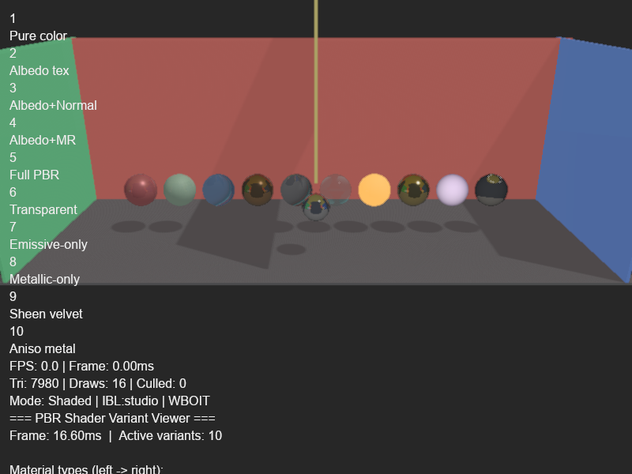

Metallic-roughness shading with IBL, plus a runtime `PbrVariantCache` that compiles
and caches up to 16 specialized shader variants (clearcoat, sheen, iridescence,
transmission, anisotropy) per scene feature mask.

### Render Features

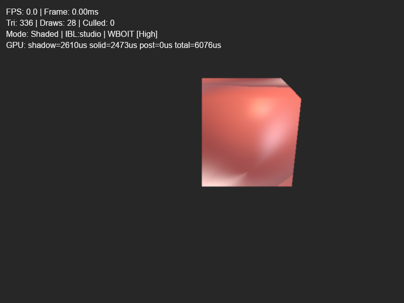

### Lighting & Reflections

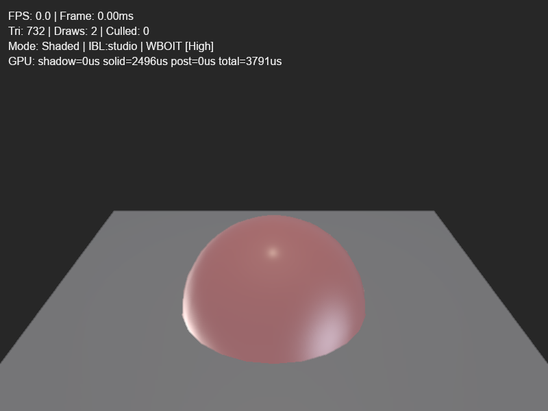
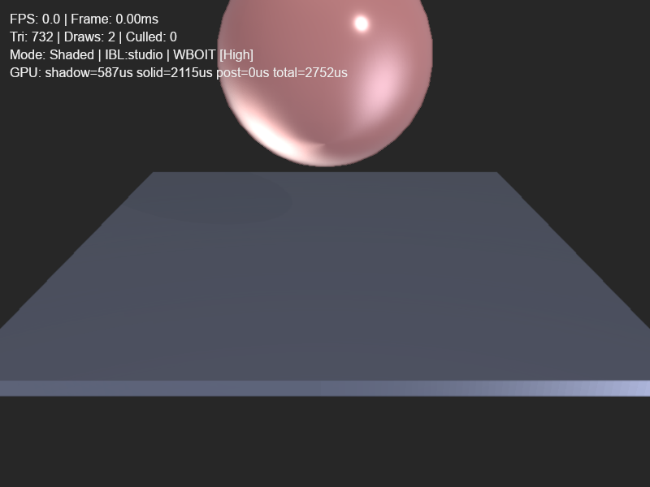
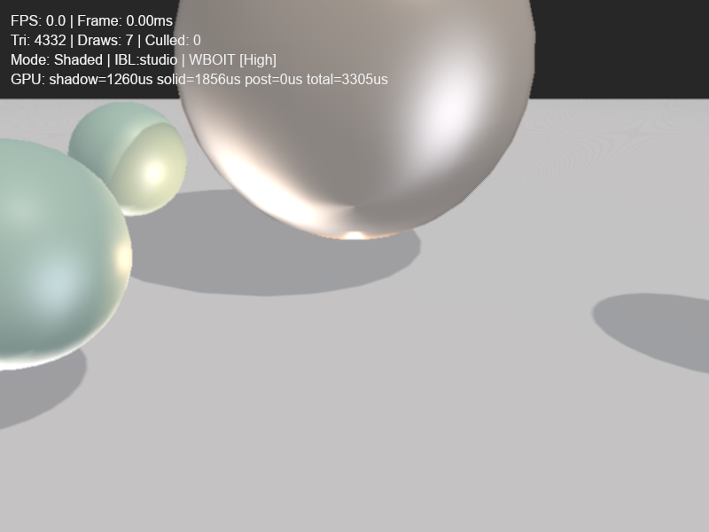

Cluster-forward lighting with area lights, planar reflections, and cascaded
shadow maps.

### Post-Processing

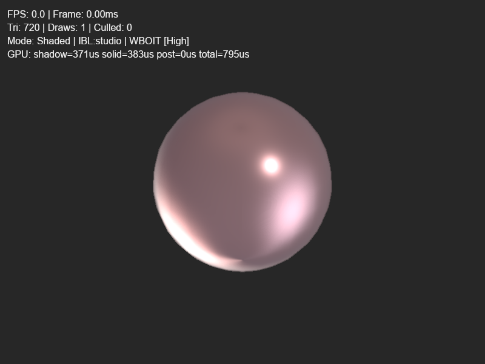
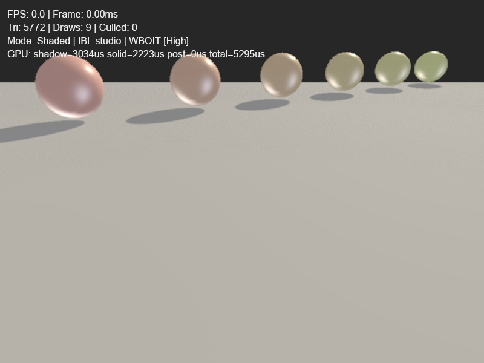

A full HDR post chain: SSAO → SSR → DoF → bloom → TAA → tonemap, plus
ray-marched volumetric fog.

### Import & Picking

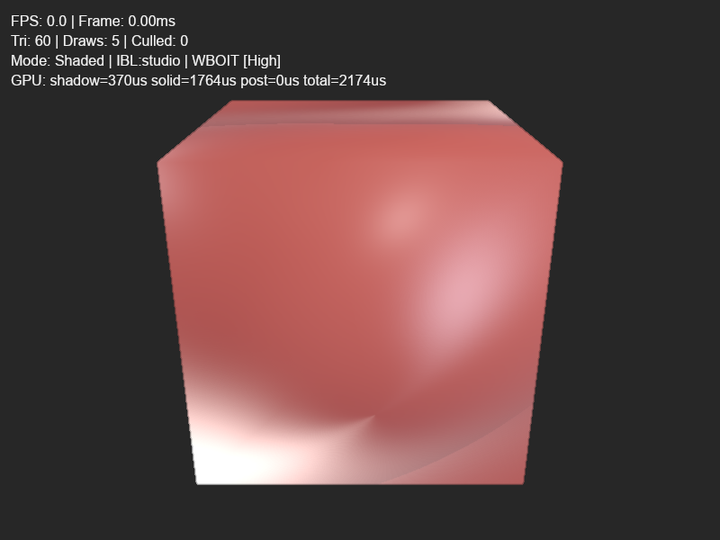
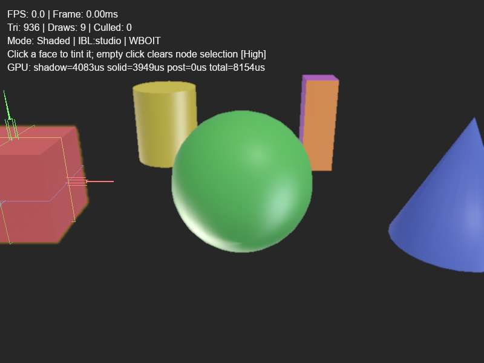

Import STL / OBJ / glTF / FBX / Inventor scenes and ray-pick faces for
selection, measurement, and annotation.

### Selection & Display Modes

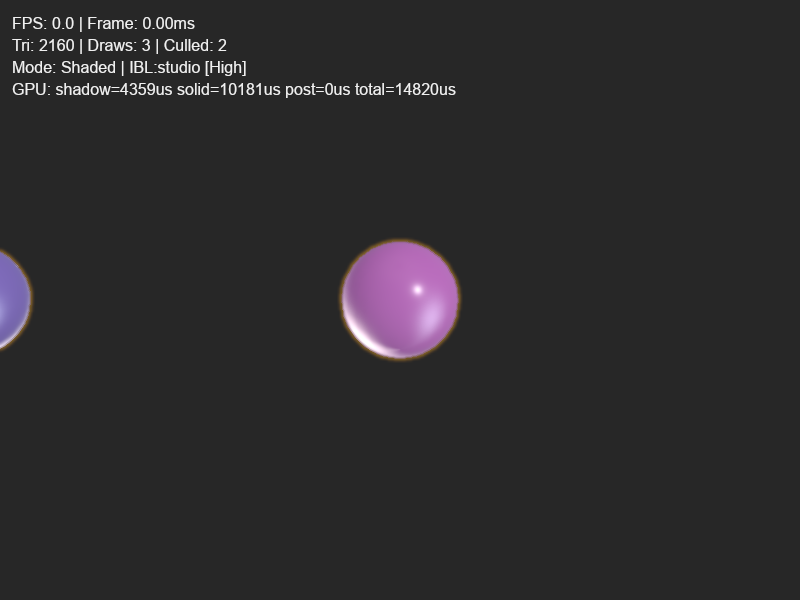
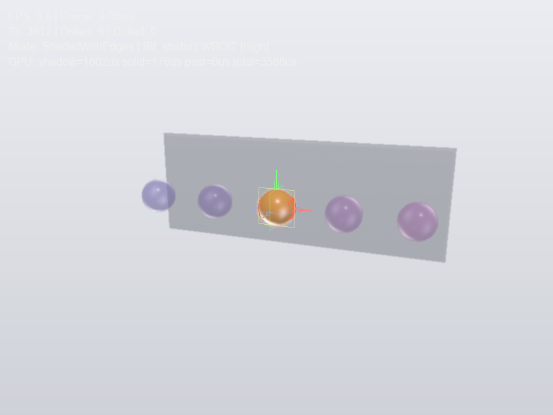
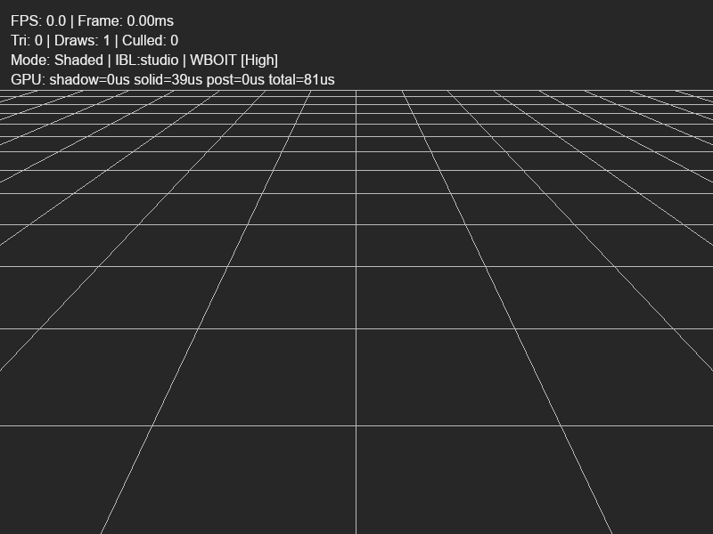

Screen-space outline for selection, hidden-line / wireframe display modes,
and indexed line sets for engineering views.

## Scene Graph (minimal example)

```rust
use rc3d_core::math::Vec3;
use rc3d_examples::common::run_example;
use rc3d_scene::node_data::*;

fn main() {
    run_example("Cube", |engine| {
        let graph = engine.scene_mut();
        let root = graph.add_root(NodeData::Separator(SeparatorNode));
        graph.add_child(root, NodeData::PerspectiveCamera(
            PerspectiveCameraNode::look_at(
                Vec3::new(3.0, 2.0, 5.0), Vec3::ZERO, Vec3::Y,
                std::f32::consts::FRAC_PI_4, 800.0 / 600.0,
            ),
        ));
        graph.add_child(root, NodeData::DirectionalLight(DirectionalLightNode {
            direction: Vec3::new(-1.0, -1.0, -1.0).normalize(),
            color: Vec3::ONE, intensity: 1.0, light_group: None,
        }));
        graph.add_child(root, NodeData::Material(MaterialNode {
            base_color: Vec3::new(0.8, 0.2, 0.2),
            roughness: 0.4, metallic: 0.0, ..Default::default()
        }));
        graph.add_child(root, NodeData::Cube(CubeNode::default()));
    });
}
```

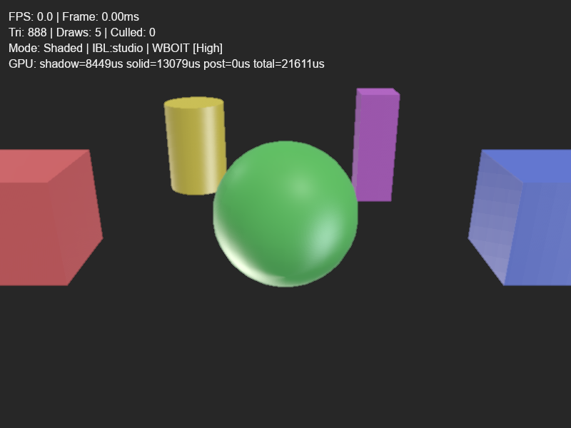
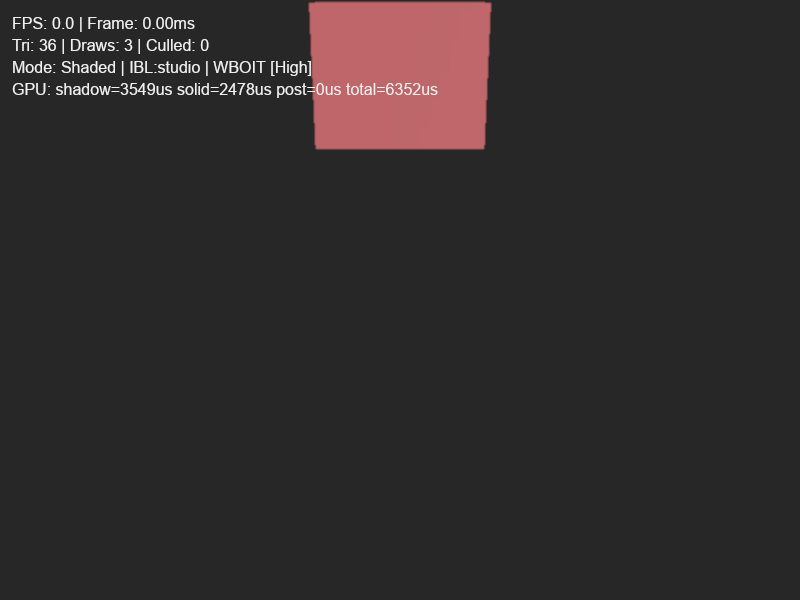

## Examples (51 demos)

| Category | Examples |
|----------|----------|
| Getting Started | `triangle`, `cube`, `rotating_cube`, `hello_scene` |
| Scene | `scene_graph`, `annotation`, `billboard`, `environment_node`, `exploded_view`, `scripted_scene` |
| Rendering | `pbr_scene`, `pbr_materials`, `pbr_variant_viewer`, `render_features`, `render_effects`, `material_variants`, `instancing`, `wboit_demo` |
| Lighting | `area_light`, `light_linking`, `shadow_demo`, `reflection` |
| Camera | `stereo_camera`, `walk_camera` |
| Import | `import_viewer` |
| Animation | `animation_demo`, `animation_control_panel`, `blend_animation` |
| Editors | `selection_set`, `picking`, `markup_dimensions`, `annotation_edit` |
| Engines | `engines_demo`, `scripted_scene` |
| Effects | `post_effects`, `volumetric_demo`, `decal_viewer`, `text3d` |
| Specialized | `nurbs_viewer`, `profile_viewer`, `section_caps`, `gdt_demo`, `stl_diagnostic` |
| Diagnostics | `adaptive_stress_test`, `large_scene_stress`, `bench` |

### CAD & Engineering

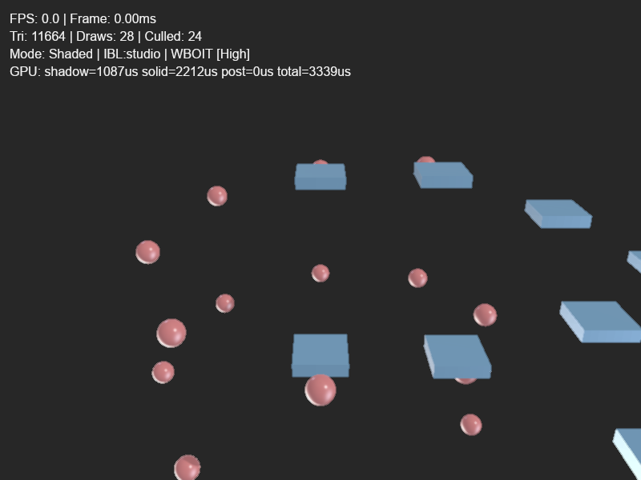
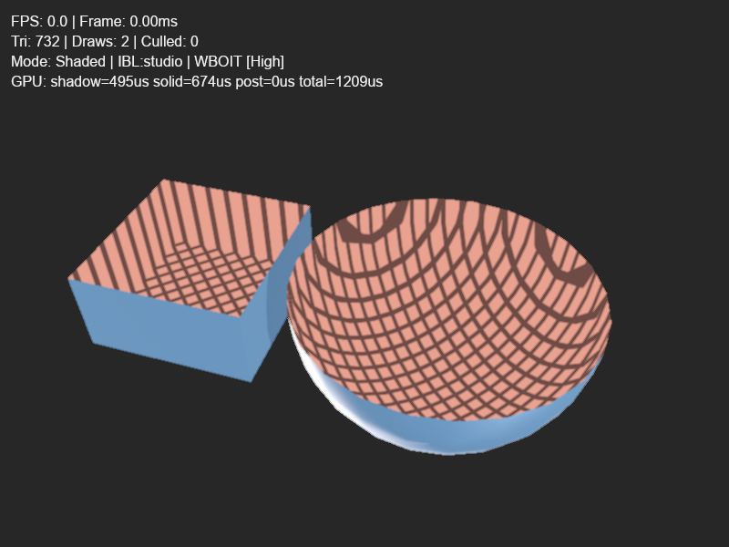
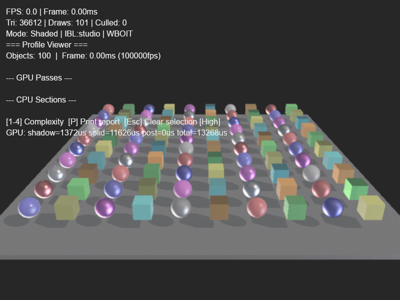
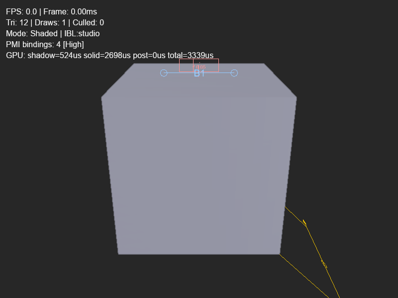

NURBS surfaces, section caps/hatch, and GD&T/PMI annotations bind to named
parts through `SceneGraph::bind_pmi`.

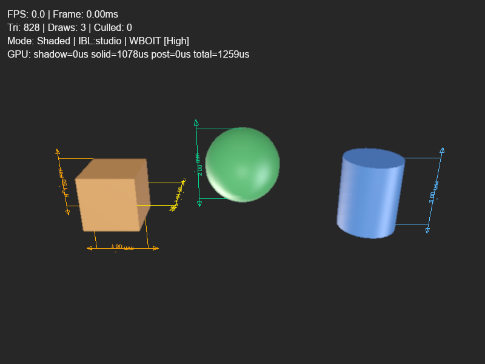

Dimension / angle / radial / leader annotations are projected into 3D with a
plane-tangent text pass (`Text2`/`Text3`).

### Point Cloud & Instancing

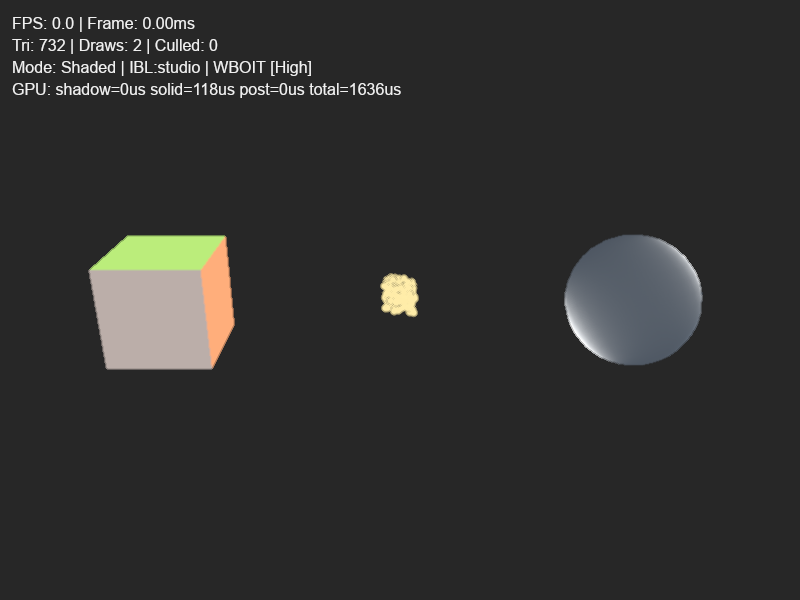
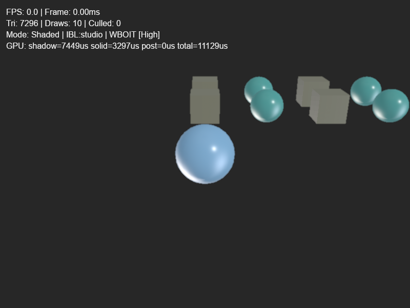

Out-of-core octree point cloud rendering and GPU instancing for repeated
geometry (BatchedMesh / InstancedMesh).

## Node Types (62 variants)

| Category | Variants |
|----------|----------|
| **Grouping** | Separator, Group, Billboard, Transform, Rotation, RotationXYZ, Coordinate3, TextureCoordinate2, Normal, ShapeHints, MaterialBinding, ResetTransform, Texture2Transform, File |
| **Shapes** | Triangle, Cube, Sphere, Cone, Cylinder, IndexedFaceSet, IndexedLineSet, SkinnedMesh, MorphTarget, Sprite, BatchedMesh, InstancedMesh |
| **Cameras** | PerspectiveCamera, OrthographicCamera, StereoCamera, CubeCamera |
| **Lights** | DirectionalLight, PointLight, SpotLight, AreaLight, HemisphereLight, LightProbe |
| **Traversal** | Lod, Switch, MultipleCopy, SectionPlane, PickStyle, EventCallback |
| **Annotations** | Text2, Text3, Measurement, Markup, Annotation, Font |
| **Manipulators** | TransformManip, Dragger, Rotation |
| **Specialized** | ExplodedView, ReflectionPlane, Decal, RayTracing, Volume, PointCloud, Environment, Material |
| **Extensibility** | HandlerNode(Arc\<dyn NodeHandler\>), Custom(u16, Box\<dyn CustomNodeData\>) |

## Performance Characteristics

| Scene | Objects | Draw Calls | Pipeline | Frame Time |
|-------|---------|------------|----------|------------|
| Stress test | 10K | ~10K | Instanced batching | ~5ms CPU |
| Stress test (static) | 10K | ~10K | Static fast path | ~1ms CPU |
| Import viewer | 1-100K | varies | Streaming mesh | ~8-16ms |
| Target (GPU) | 1M+ | indirect | GPU-driven | TBD |

Key optimizations:
- **Light dedup**: 1280B → 4B per draw call (LightSetTable)
- **Static fast path**: Zero culling work when scene is idle
- **Frame allocation reuse**: 8 Vecs reused across frames (~60MB savings @ 1M objects)
- **BVH incremental**: Only dirty AABBs trigger BVH updates
- **Direct cache emit**: FlatDrawCache populated during traversal (no conversion pass)
- **Pool expansion**: phong 64K, flat 32K, mesh cache 4K

## Development

```bash
cargo check --workspace          # fast compile check
cargo test                       # 328 tests
cargo build -p rc3d-examples --examples
cargo run -p rc3d-studio         # desktop editor
cargo clippy --workspace         # lint check
```

## Studio Desktop Editor

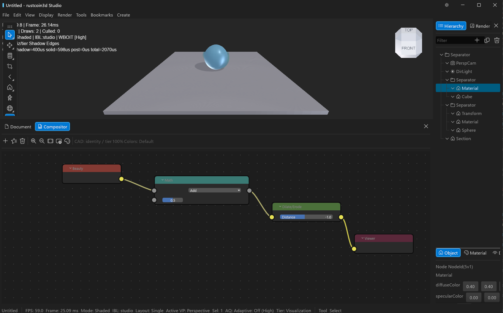

`rc3d-studio` is the flagship desktop application:

- **Workspaces**: Model / LookDev / Compositor quick layouts
- **Docks**: side dock (Hierarchy+Inspector split, Render, History, Assets), bottom dock (Document, Compositor), movable tool strip
- **Compositor editor**: Blender-style node graph (`egui-snarl`) with a two-level Add menu and collapse-state persistence
- **Case library**: 24 parameter/process demo cases with step-by-step guidance
- **i18n**: English / Simplified Chinese (450-key catalogs)
- **Keymap**: default shortcuts with per-user overrides persisted to `%APPDATA%\rustcoin3d\ui-prefs.json`
- **CAD matrix check**: `rc3d-studio --cad-matrix` runs the tier/compositor verification matrix

## Dependencies

| Crate | Purpose |
|-------|---------|
| wgpu 30 | GPU abstraction (Vulkan/Metal/DX12) |
| winit 0.30 | Window creation and event loop |
| egui 0.36 / eframe 0.36 | Immediate-mode UI (editor + studio) |
| glam 0.29 | Linear algebra (Vec3, Mat4, Quat) |
| slotmap | Stable-ID arena storage for scene graph |
| glyphon 0.12 | GPU text rendering (HUD) |
| rayon | Parallel traversal |
| rhai | Embedded scripting |
| meshopt | Mesh optimization (meshlets, LOD) |
| serde/serde_json | Serialization |
| image | Texture loading |
| tracy-client | GPU/CPU profiling |

## License

BSD-3-Clause
